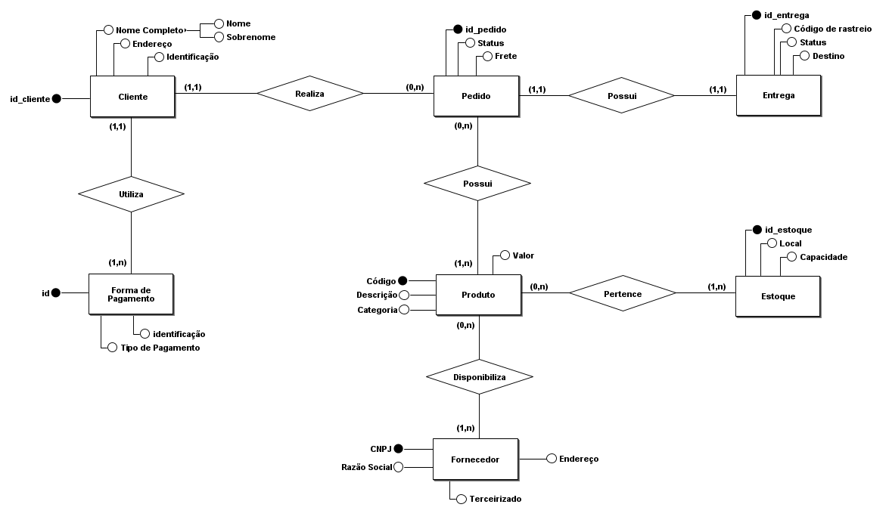
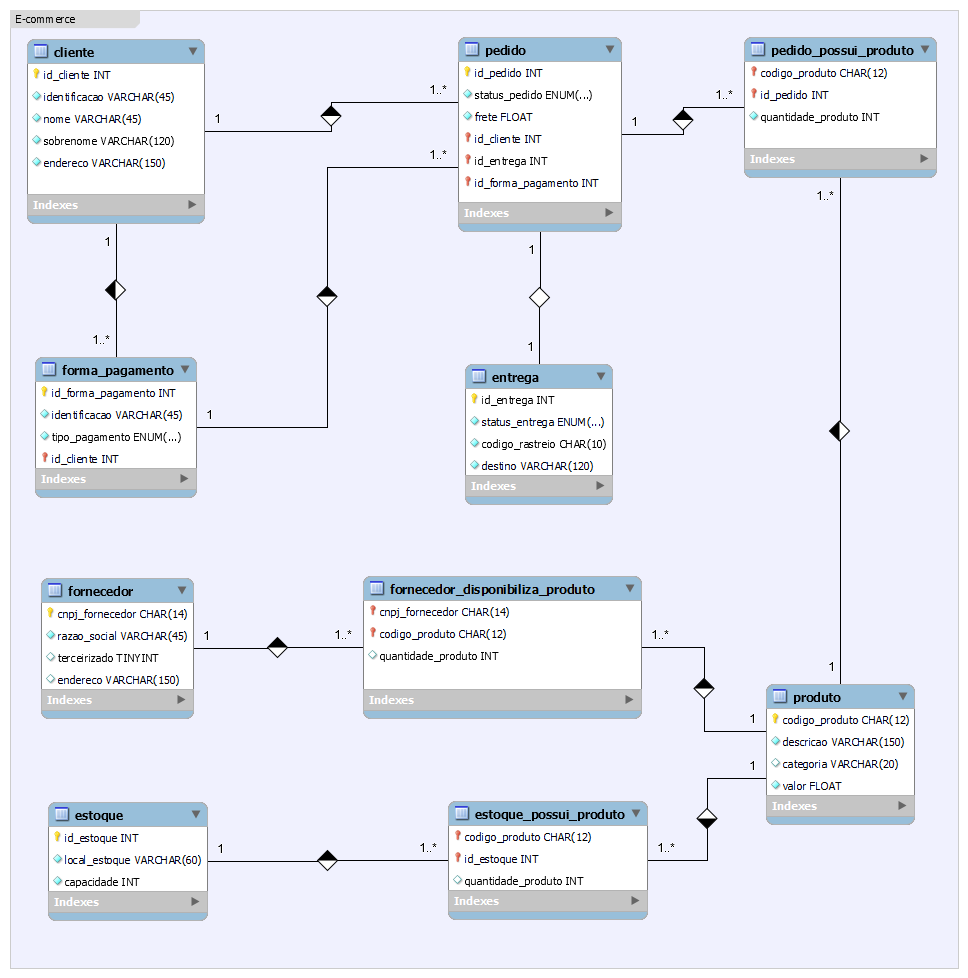

# Descrição

Modelagem de dados para um sistema de E-commerce utilizando diagrama ER para o esquema conceitual e diagrama EER para o esquema lógico, além disso, está incluído um script que pode ser usado com o SGBD PostgreSQL.

## Narrativas

### Produto

- Os produtos são vendidos por uma única plataforma online. Contudo, estes podem ter vendedores distintos (terceiros);
- Cada produto possui um fornecedor;
- Um ou mais produtos podem compor um pedido.

### Cliente

- O cliente pode se cadastrar no site com seu CPF ou CNPJ;
- O endereço do cliente irá determinar o valor do frete;
- Um cliente pode realizar mais de um pedido.

### Pedido

- Os pedidos são criados por clientes e possuem informações de compra, endereço e status da entrega;
- Um produto ou mais compoem o pedido;
- O pedido pode ser cancelado.

---

## Esquemas

### Conceitual

Este projeto está no arquivo `ecommerce_conceitual.brM3` que foi feito utilizando a ferramenta **brModelo**.

---

### Lógico

Este projeto está presente no arquivo `ecommerce.mwb` e pode ser aberto com o software **MySQL Workbench**.

---

### Físico

O arquivo `script_ecommerce.sql` permite criar o esquema físico no SGBD **PostgreSQL**. Neste script há comandos responsáveis por fazer definições (DDL), manipulações (DML) e consultas (DQL) ao banco de dados.

> Dica: Este script pode ser executado no **psql** utilizando o comando `\i` juntamente com o caminho completo do arquivo `.sql`.
